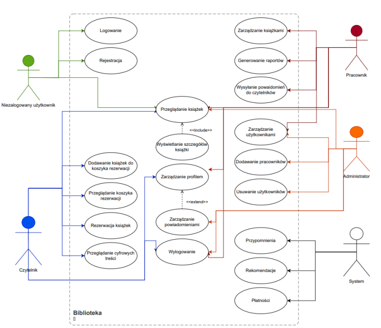
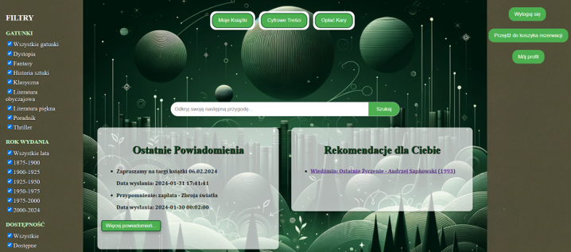
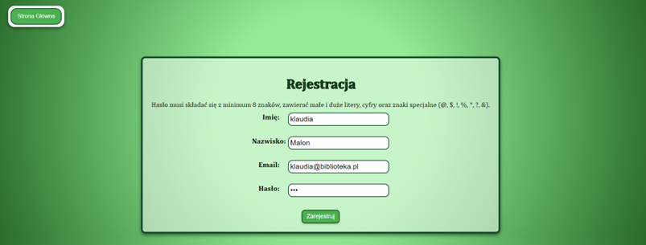
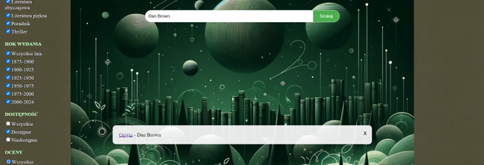
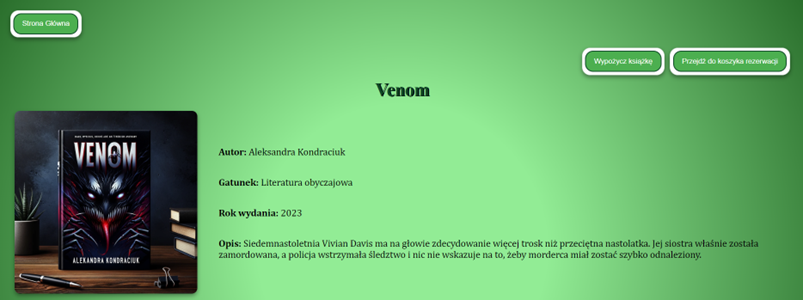
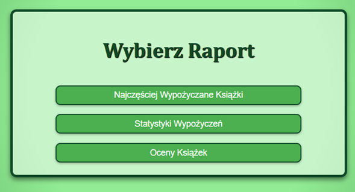
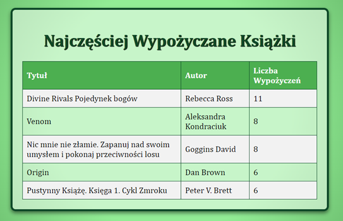

# Library management system based on web technology - backend

The project is a web application built using Flask and various libraries to provide a comprehensive library management system. It features user authentication managed by Flask-Login, session handling, and a robust backend database interaction using SQLAlchemy. The application supports complex functionalities such as user registration, login, book search with filters, book reservations, and recommendations using machine learning for better accuracy.

## Technologies

* Flask - version 2.2.5
* Flask-Login - version 0.6.3
* SQLAlchemy - version 2.0.23
* Werkzeug - version 2.2.3
* Celery - version 5.2.7
* Redis - version 4.4.0
* Stripe - version 7.12.0
* Flask-Cors - version 4.0.0
* Azure Storage Blob - version 12.19.0
* Pandas - version 1.3.5
* NumPy - version 1.21.6

## Launch

__Cloning the repository__

`git clone https://github.com/Klau-Klau/biblioteka.git`

To launch the backend, Docker is used, which allows for the creation of an isolated environment for the application along with all its dependencies. Docker-compose is utilized to define and run a multi-container Docker application. The backend is launched using the command:

`docker-compose up`

__Link to the backend repository:__ https://github.com/Klau-Klau/library-frontend.git

## Features

* Registration, Login
* Browsing available books in the library with filters and sorting
* Book reservations
* Digital content
* Fees for overdue books
* Profile editing
* Notifications and recommendations
* Adding and editing books
* Reports
* Deleting users

## Screenshots

* Use case diagram for library application



* Home Page



* Registration form for a new user with an example of a password that does not meet requirements



* Example of searching for a book by author



* Book details page
  


* Choice of Report Type for Employees

 

* Most frequently borrowed books report



## Usage

Use cases and code examples

### Registration

The following code checks whether the first and last names start with a capital letter and contain at least two letters. This is a basic validation aimed at ensuring data consistency within the system.

```python
if not re.match(r'^[A-Z][a-z]{1,}$', name) or not re.match(r'^[A-Z][a-z]{1,}$', 
surname):
 return jsonify({'success': False,
 'error': 'Imię i nazwisko muszą zaczynać się z wielkiej 
litery i zawierać przynajmniej 2 litery.'}), 400
```

### Book search

This code snippet is responsible for filtering books in the database based on a provided search string. If a search query is given, the code filters the book records by searching for matching titles, authors, or ISBN numbers that include the specified string. It uses the _ilike_ operator, which allows for case-insensitive searching and for any characters before and after the searched phrase.

```python
if search_query:
 query = query.filter(or_(
 Book.title.ilike(f'%{search_query}%'),
 Book.author.ilike(f'%{search_query}%'),
 Book.ISBN.ilike(f'%{search_query}%')
 ))
```

At the end, results can be sorted according to criteria such as the newest, oldest, highest-rated, lowest-rated, most popular, least popular, alphabetically from A to Z, or from Z to A. The appropriate _order_by_ clauses are used depending on the selected sorting criterion. Sorting by the criteria of newest, oldest, and highest-rated is demonstrated in the following code snippet.

```python
if sort == 'newest':
 query = query.order_by(Book.publication_year.desc())
elif sort == 'oldest':
 query = query.order_by(Book.publication_year)
elif sort == 'highest_rating':
 review_subquery = db_session.query(
 Review.book_id,
 func.avg(Review.rating).label('average_rating')
 ).group_by(Review.book_id).subquery()
 query = query.outerjoin(review_subquery, Book.id == 
review_subquery.c.book_id) \
 .order_by(review_subquery.c.average_rating.desc())
```

### Loan

Library staff have the capability to loan books to users. In the code snippet, a new _Loan_ object is created, representing the loan of a book to a user. 

The status of the book copy is changed to "loaned," indicating that the book has been borrowed by the user and is no longer available to others. The reservation status for this copy is updated to "completed." 

After creating the object representing the new loan and updating the relevant statuses, the _new_loan_ object is added to the database session.

```python
new_loan = Loan(
 user_id=reservation.user_id if reservation else current_user.id,
 # Przypisz do użytkownika z rezerwacji lub obecnie zalogowanego użytkownika
 book_id=copy_id,
 status='w trakcie',
 due_date=due_date
)
# Zmiana statusu egzemplarza książki i rezerwacji
book_copy.status = 'wypożyczona'
if reservation:
 reservation.status = 'zakończona'
# Zapisanie zmian w bazie danych
db_session.add(new_loan)
db_session.commit()
```

## Project Status

The project is complete. However, in the future, I want to develop some functionalities further:

* Expansion of mobile device functionality: Development of a dedicated mobile application. This would allow readers to easily use the library application on their phones.
* Development of the recommendation module: Implementation of more advanced recommendation algorithms, such as those based on machine learning. This would enable better matching of recommendations based on individual user preferences and their borrowing history.
* Expansion of the digital content module: Adding the option to browse the contents of books online without the need to download files and the ability to listen to audiobooks directly from the browser would increase the accessibility and appeal of the library's digital resources.

## Contact

Link to the LinkedIn profile

https://www.linkedin.com/in/klaudia-malon-898330305/